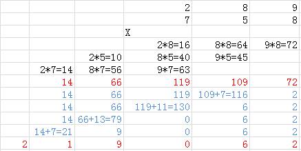

# 43. Multiply Strings \(M\)

### [Problem link](https://leetcode.com/problems/multiply-strings/)

### Problem statement

Given two non-negative integers `num1` and `num2` represented as strings, return the product of `num1` and `num2`, also represented as a string.

**Example 1:**

```text
Input: num1 = "2", num2 = "3"
Output: "6"
```

**Example 2:**

```text
Input: num1 = "123", num2 = "456"
Output: "56088"
```

**Note:**

1. The length of both `num1` and `num2` is &lt; 110.
2. Both `num1` and `num2` contain only digits `0-9`.
3. Both `num1` and `num2` do not contain any leading zero, except the number 0 itself.
4. You **must not use any built-in BigInteger library** or **convert the inputs to integer** directly.

### Analysis

**The result of multiplying an m-bit integer by an n-bit integer is at most m+n bits** 

Take `289 * 758` as an example:



* Firstly, reverse two strings of numbers
* Do multiplication for each bit
* Save the temporary result in a array
* We have `num1[i] * num2[j] == arr[i+ j]`
* For each num in `arr`,  `arr//10` is the number we need to carry to the next bit and `arr % 10`is the number we keep
* Take care of leading zeros!

### Solution



```python
class Solution:
    # @param num1, a string
    # @param num2, a string
    # @return a string
    def multiply(self, num1, num2):
        num1 = num1[::-1]
        num2 = num2[::-1]
        arr = [0 for i in range(len(num1)+len(num2)]
        
        for i in range(len(num1)):
            for j in range(len(num2)):
                arr[i+j] += int(num1[i]) * int(num2[j])
        
        ans = []
        for i in range(len(arr)):
            digit = arr[i] % 10
            carry = arr[i] // 10
            if i < len(arr) - 1:
                arr[i + 1] += carry
            ans.insert(0, str(digit))
        
        while ans[0] == '0' and len(ans) > 1:
            del ans[0]
        return ''.join(ans)
        
        
```



```python

```



```python

```



```python

```



```python

```



### References

[JustDoIt](https://www.cnblogs.com/TenosDoIt/p/3735309.html)

\*\*\*\*[**https://www.cnblogs.com/zuoyuan/p/3781515.html**](https://www.cnblogs.com/zuoyuan/p/3781515.html)\*\*\*\*

